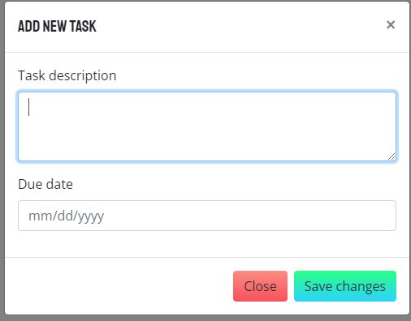

# Task Master Pro

## Description 

A Enhanced Web Application to keep track of your tasks!!
Using bootstrap and web-api

Repo: https://github.com/andrewyu22/taskmaster-pro

Link: https://andrewyu22.github.io/taskmaster-pro/

---
## Table of Contents 

* [Installation](#installation)
* [Usage](#usage)
* [License](#license)
* [Contributing](#contributing)
* [Tests](#tests)
* [Questions](#questions)

---
## Installation

No Installation required for this project!

---
## Usage 

1) Enter a new Task & Select Task Type

2) Move the Tasks to the correct tab (Now draggable Field)

---
## License

No Licenses for this project!

---
## Contributing

No contribution information for this project!

---
## Tests

No test for this project!

---
## Questions

Link to Github: https://github.com/andrewyu22

If you have any further questions, please contact me at andrewyu2654@gmail.com